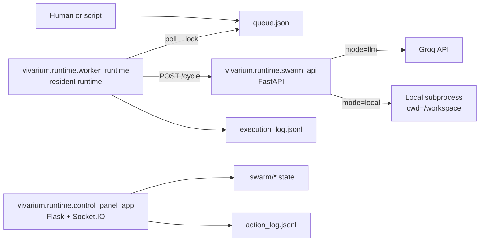

# Vivarium

Vivarium is built on a simple bet: if AI residents have continuity (identity), feedback loops, and room for voluntary collaboration, output quality can compound instead of resetting every run.

The core is still concrete engineering, not mysticism:

**queue -> resident runtime -> API call -> logs -> verification -> iteration**

But the social layer (guilds, journals, disputes, hats, bounties) is intentional. It is the mechanism for critique, specialization, and compounding behavior over time.

Today, the repo is in an "implemented core + partially wired vision" state. This README now tracks both:

1. **What runs right now**
2. **What gets us to the full vision, in order**

---

## Repository structure (cleanup pass)

This repo now follows a strict golden-path policy:
- **only canonical runtime execution is supported**
- **no optional detached runner paths**
- **runtime entrypoints live under `vivarium/runtime/`**

- `vivarium/physics/` - swarm-world invariants + control surface (`world_physics.py`) and shared math utils
- `vivarium/swarm_environment/` - fresh environment API for new swarm interaction loops
- `vivarium/runtime/` - canonical runtime implementations and entrypoints
- `docs/` - roadmap, architecture notes, and operational playbooks

---

## Current state snapshot (2026-02-09)

| Area | Status | Notes |
| --- | --- | --- |
| Phase 0 - Canonical runtime | Implemented | Canonical runtime entrypoints live under `vivarium/runtime/` (`worker_runtime.py`, `swarm_api.py`, `control_panel_app.py`). |
| Phase 1 - Safety gating | Implemented in worker path | Worker preflight safety checks run before task dispatch. |
| Phase 2 - Quality/critic lifecycle | Implemented | Post-execution review transitions include `pending_review`, `approved`, `requeue`, and `failed`. |
| Phase 3 - Tool-first compounding | Implemented | Tool routing runs before LLM dispatch and logs route metadata. |
| Phase 4 - Intent + decomposition | Implemented (foundation) | Complex prompts can be decomposed into dependency-aware subtasks in queue flow. |
| Phase 5 - Social/economic loop | Implemented (initial) | Approved under-budget tasks can grant identity rewards via `swarm_enrichment`, deduplicated per task+identity via `.swarm/phase5_reward_ledger.json`. |
| Phase 6 - Multi-user/LAN + vision dashboard | Planned | Design references exist; not reintroduced into runtime yet. |
| Phase 7 - Autonomous improvement checkpoints | Planned | Proposal/review/apply loop and rollback hardening still pending. |

Latest validated runtime regression checks:

```bash
python3 -m pytest -q tests/test_runtime_phase2_quality_review.py tests/test_runtime_phase0_phase1.py tests/test_runtime_phase3_tool_routing.py tests/test_runtime_phase4_intent_decomposition.py
# Result: 22 passed
```

### Human timescale framing (compressed)

- One execution unit is a **cycle**.
- Daily operations should be discussed as **today's cycles**.
- Medium-term planning should be discussed in **this week / next week** windows.

### Hard evidence snapshot (as of 2026-02-09)

The strongest verifiable signals currently in logs/history:

- **Self-learning signal (promising):** In historical `performance_history.json`
  (commit `5b6a0b6`), average quality score rises from `0.858` (first 10
  sessions) to `0.995` (last 10), a `+15.97%` lift.
- **Execution evidence at scale:** In historical `structured_logs.jsonl`
  (commit `5b6a0b6`), there are `153` completed sessions with an `86.93%`
  completion success rate and a median elapsed time of `70.441s`.
- **Cost and guardrail evidence in current runtime logs:** `api_audit.log` shows
  successful costed calls (4 successes, total logged success cost
  `0.05331729`) and explicit budget enforcement (`BUDGET_EXCEEDED` event).

More results to come tomorrow (2026-02-10).

---

## Current architecture (as implemented)



---

## Known gaps (active)

- Direct human-triggered `/cycle` execution is now blocked by loopback + internal-token enforcement; the intended human entrypoint is the localhost control panel.
- `worker_pool.py` remains experimental/non-canonical until repaired and re-validated.
- Phase 6 and Phase 7 outcomes are still roadmap items, not runtime defaults.

---

## The path to the full vision (ordered)

For the full, phased execution plan plus acceptance criteria, see:

- **[`VISION_ROADMAP.md`](./docs/VISION_ROADMAP.md)**
- **[`CROSS_REPO_TIMELINE.md`](./docs/CROSS_REPO_TIMELINE.md)** (Vivarium + AutoHive timeline, "gold" extraction, anomaly map)
- **[`RUNTIME_GOLDEN_PATH.md`](./docs/RUNTIME_GOLDEN_PATH.md)** (Phase 0 canonical runtime + safety contract)

Short version of build order:

1. **Canonicalize the runtime path**
   - Make `vivarium/runtime/{worker_runtime.py, swarm_api.py, control_panel_app.py}` the source of truth, surfaced via root entrypoint shims.
   - Quarantine or repair non-canonical orchestration remnants.
2. **Wire hard safety gates into execution**
   - Enforce `safety_gateway` + `secure_api_wrapper` on actual task execution paths, not only tests/startup scripts.
3. **Wire quality gates post-execution**
   - Connect `quality_gates.py` + critic checks to task lifecycle transitions (`pending_review`, `approved`, `requeue`).
4. **Restore tool-first compounding loop**
   - Restore `SkillRegistry`/`tool_router` compatibility and route suitable tasks through tool context before full LLM generation.
5. **Promote intent/planning pipeline into production**
   - Integrate intent gatekeeping and deterministic decomposition into the canonical queue flow.
6. **Deepen identity + governance loops**
   - Keep social/economic systems first-class but auditable, with explicit APIs and invariants.
7. **Harden guarded collaboration surfaces**
   - Reintroduce LAN/multi-user/vision capabilities only behind explicit safety boundaries.
8. **Autonomy with explicit human checkpoints**
   - Enable continuous self-improvement loops with review gates and rollback controls.

---

## Git archaeology (lost vision + "whoops" map)

Recent history shows a major cleanup and rollback cycle. Key findings:

- **`4428452`** - "Purge Claude/Anthropic artifacts and docs" removed many architecture/vision documents and experimental modules.
- **`5b6a0b6`** - backup commit ("before clean rollback") preserved many deleted assets.
- **`75b046c`** - introduced a `/vision` dashboard route in historical `progress_server.py` (file now absent).
- **AutoHive (public)** - contains useful orchestration/economics patterns plus wiring mismatches; details in `docs/CROSS_REPO_TIMELINE.md`.
- **Developer provenance note** - this work is reported as almost entirely vibe-coded (roughly 10-20 manually typed lines total), with full Claude Code JSONL telemetry backups (including thinking blocks and tool calls) available for future intent-drift forensics.

Important artifacts that existed in history but are absent now:

| Artifact | Last known location | Why it matters now |
| --- | --- | --- |
| `SWARM_ARCHITECTURE_V2.md` | `4428452^:SWARM_ARCHITECTURE_V2.md` | Detailed multi-node roadmap (intent -> planning -> atomizer -> worker pool -> critic/test gates). |
| `MULTI_USER_LAN_DESIGN.md` | `4428452^:MULTI_USER_LAN_DESIGN.md` | Multi-user LAN collaboration design and security model. |
| `ADAPTIVE_ENGINE_SPEC.md` | `4428452^:ADAPTIVE_ENGINE_SPEC.md` | Prior routing logic for complexity/budget-aware model selection. |
| `progress_server.py` with `/vision` route | `75b046c:progress_server.py` | Historical "living vision dashboard" path. |
| `config/tool_store.json` + related prototypes | `5b6a0b6` root | Previous tool-first accumulation direction. |

Historical code-quality signal worth acting on:

- `tool_router.py` expects `SkillRegistry`, `retrieve_skill`, `compose_skills` (now restored in `vivarium/skills/skill_registry.py`).
- Canonical `worker_runtime.py` now runs tool-first routing before LLM dispatch and logs routing metadata (`tool_route`, `tool_name`, `tool_confidence`).
- Canonical `worker_runtime.py` now performs deterministic Phase 4 intent/decomposition planning for complex prompts, compiling dependency-aware subtasks into `queue.json` before parent execution.
- Canonical `worker_runtime.py` now includes an initial Phase 5 hook: approved under-budget tasks can grant auditable identity rewards via `swarm_enrichment`, with idempotent task+identity reward grants recorded in `.swarm/phase5_reward_ledger.json`.
- `worker_pool.py` currently contains generated fragments and is not safe as a production orchestration entrypoint.

The recovery sequence for these findings is defined in `docs/VISION_ROADMAP.md`.

---

## Data flow

### A) Queue-driven execution flow (default)

1. Tasks are added to `queue.json` (CLI or manual edit).
2. One or more `python -m vivarium.runtime.worker_runtime run` processes:
   - scan available tasks,
   - enforce dependency checks,
   - acquire `task_locks/<task_id>.lock`.
3. Worker sends each task to `POST /cycle` in `vivarium/runtime/swarm_api.py`.
4. `/cycle` executes either:
   - **LLM mode**: Groq chat completions.
   - **Local mode**: shell command in the workspace.
5. Worker appends lifecycle events to `execution_log.jsonl` and releases the lock.

### B) Planning flow

1. `POST /plan` scans Python files in the repo.
2. It asks Groq for 3-5 suggested improvements.
3. It writes a new `queue.json`.

### C) Control panel flow

1. `vivarium/runtime/control_panel_app.py` serves UI on `:8421` and streams `action_log.jsonl`.
2. Human request and identity collaboration APIs write/read `.swarm/*` state.
3. Runtime execution remains queue-driven through `worker_runtime.py` + `swarm_api.py`.

---

## Main entrypoints

| File | Role |
| --- | --- |
| `vivarium/runtime/swarm_api.py` | FastAPI execution API (`/cycle`, `/plan`, `/status`) |
| `vivarium/runtime/worker_runtime.py` | Resident runtime: queue polling, lock protocol, task execution, event logging |
| `vivarium/runtime/control_panel_app.py` | Web UI + API for monitoring, identities, bounties, and chatrooms |
| `vivarium/runtime/resident_onboarding.py` | Identity selection, cycle/day tracking, resident context injection |
| `vivarium/runtime/swarm_enrichment.py` | Token economy, journals, guild voting, disputes, bounty reward distribution |
| `vivarium/runtime/runtime_contract.py` | Canonical queue/task normalization and execution status vocabulary |

---

## Runtime state and files

| Path | Writer(s) | Purpose |
| --- | --- | --- |
| `queue.json` | `worker_runtime.py add`, `swarm_api.py /plan` | Shared task queue |
| `task_locks/*.lock` | `worker_runtime.py` | Atomic lock files to prevent duplicate task pickup |
| `execution_log.jsonl` | `worker_runtime.py` | Task lifecycle events (`in_progress`, `completed`, `failed`, subtasks) |
| `action_log.jsonl` + `action_log.log` | `vivarium/runtime/action_logger.py` consumers | Human-readable and structured activity stream |
| `.swarm/identities/*.json` | onboarding/enrichment flows | Persistent identity records |
| `.swarm/free_time_balances.json` | `vivarium/runtime/swarm_enrichment.py` | Token wallets (free-time + journal pools) |
| `.swarm/phase5_reward_ledger.json` | `worker_runtime.py` | Auditable, idempotent ledger for worker-driven under-budget reward grants |
| `.swarm/bounties.json` | control panel + enrichment | Bounty definitions, submissions, payout state |
| `.swarm/discussions/*.jsonl` | social/dispute systems | Chatroom history |
| `.swarm/messages_to_human.jsonl` | resident social systems | Resident-to-human message queue |
| `.swarm/messages_from_human.json` | control panel | Human responses |
| `HALT`, `PAUSE` | kill switch / runtime safety | Emergency stop / pause controls |
| `library/community_library/**` | worker + resident docs flows | Community Library docs + resident suggestions |
| `library/creative_works/*` | `vivarium/runtime/swarm_enrichment.py` | Resident-generated creative artifacts |

Most `.swarm/*` content is runtime-generated.

---

## Queue task schema (current)

Example:

```json
{
  "version": "1.0",
  "api_endpoint": "http://127.0.0.1:8420",
  "tasks": [
    {
      "id": "task_001",
      "type": "cycle",
      "prompt": "Summarize architecture gaps",
      "min_budget": 0.05,
      "max_budget": 0.10,
      "intensity": "medium",
      "depends_on": [],
      "parallel_safe": true,
      "model": "llama-3.1-8b-instant"
    }
  ],
  "completed": [],
  "failed": []
}
```

Task fields recognized by current runtime include:
- `prompt` / `instruction` / `description` / `task`
- `command` or `shell` (local command mode)
- `mode` (`llm` or `local`)
- `depends_on`
- `model` (validated against `vivarium/runtime/config.py` whitelist)
- decomposition hints (`decompose`, `max_subtasks`, `subtask_parallelism`)

---

## API surface

### `vivarium/runtime/swarm_api.py` (FastAPI)

- `POST /cycle` - execute one task (`llm` or `local` mode)
- `POST /plan` - scan codebase and write planned tasks to `queue.json`
- `GET /status` - queue summary

### `vivarium/runtime/control_panel_app.py` (Flask)

Notable route groups:
- identities and profile views
- human message request/response APIs
- bounty CRUD, submissions, and completion
- artifact viewer/listing
- chatroom history APIs

---

## Safety boundaries (current state)

### Enforced in the default queue/worker path

- model whitelist enforcement (`config.validate_model_id`)
- lock-based concurrency protection (`task_locks`)
- dependency gating via `depends_on`
- explicit halt/pause file controls (when used)
- post-execution critic + quality-gate transitions (`pending_review` -> `approved` / `requeue`)
- pre-LLM tool routing and reusable tool-context injection (`tool_router` + skill registry)
- intent capture + deterministic decomposition with dependency-aware subtask compilation in the queue worker path
- Phase 5 reward grants are deduplicated per task+identity and recorded in `.swarm/phase5_reward_ledger.json`

### Available modules (not automatically on the `/cycle` path)

- `safety_gateway.py`
- `safety_validator.py` (safe write/checkpoint flow)
- `secure_api_wrapper.py`

These exist and are test-covered in `tests/`; safety, quality, and tool-routing modules are now wired into the canonical `worker_runtime.py` lifecycle. `/cycle` and `/plan` now require loopback origin plus the internal execution token.

---

## Quick start

### 1) Core queue + API runtime

```bash
python -m venv .venv
source .venv/bin/activate
pip install -r requirements.txt -r requirements-groq.txt

export GROQ_API_KEY=...
uvicorn vivarium.runtime.swarm_api:app --host 127.0.0.1 --port 8420
```

In another terminal:

```bash
python -m vivarium.runtime.worker_runtime add task-001 "Summarize current architecture and data flow"
python -m vivarium.runtime.worker_runtime run
```

### 2) Control panel UI

```bash
pip install watchdog
python -m vivarium.runtime.control_panel_app
```

Open: `http://localhost:8421`

Note: control panel access is localhost-only by default (`127.0.0.1` / `localhost`), and LAN/multi-user exposure stays deferred behind future Phase 6 work.

One-click script:
- macOS/Linux: `./one_click_server.sh`
- Windows: `one_click_server.bat`

## Notes

- `README_VISION.md` is the philosophical framing.
- This README covers both **what runs now** and the **ordered path to full scope**.
- The system is still experimental; run in an isolated environment.

