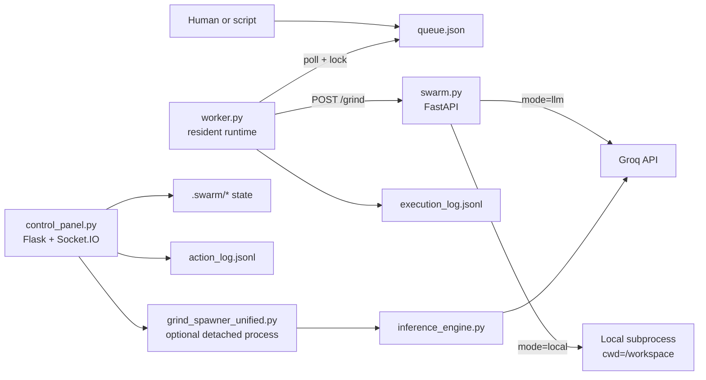

# Vivarium

Vivarium is built on a simple bet: if AI residents have continuity (identity), feedback loops, and room for voluntary collaboration, output quality can compound instead of resetting every run.

The core is still concrete engineering, not mysticism:

**queue -> resident runtime -> API call -> logs -> verification -> iteration**

But the social layer (guilds, journals, disputes, hats, bounties) is intentional. It is the mechanism for critique, specialization, and compounding behavior over time.

Today, the repo is in an "implemented core + partially wired vision" state. This README now tracks both:

1. **What runs right now**
2. **What gets us to the full vision, in order**

---

## Current architecture (as implemented)



---

## The path to the full vision (ordered)

For the full, phased execution plan plus acceptance criteria, see:

- **[`VISION_ROADMAP.md`](./VISION_ROADMAP.md)**
- **[`CROSS_REPO_TIMELINE.md`](./CROSS_REPO_TIMELINE.md)** (Vivarium + AutoHive timeline, "gold" extraction, anomaly map)
- **[`RUNTIME_GOLDEN_PATH.md`](./RUNTIME_GOLDEN_PATH.md)** (Phase 0 canonical runtime + safety contract)

Short version of build order:

1. **Canonicalize the runtime path**
   - Make `worker.py + swarm.py + control_panel.py` the explicit source of truth.
   - Quarantine or repair legacy/broken orchestration remnants.
2. **Wire hard safety gates into execution**
   - Enforce `safety_gateway` + `secure_api_wrapper` on actual task execution paths, not only tests/startup scripts.
3. **Wire quality gates post-execution**
   - Connect `quality_gates.py` + critic checks to task lifecycle transitions (`pending_review`, `approved`, `requeue`).
4. **Restore tool-first compounding loop**
   - Restore `SkillRegistry`/`tool_router` compatibility and route suitable tasks through tool context before full LLM generation.
5. **Promote intent/planning pipeline into production**
   - Integrate intent gatekeeping and deterministic decomposition into the canonical queue flow.
6. **Deepen identity + governance loops**
   - Keep social/economic systems first-class but auditable, with explicit APIs and invariants.
7. **Reintroduce optional networked collaboration**
   - Bring back LAN/multi-user/vision dashboard capabilities behind safety boundaries.
8. **Autonomy with explicit human checkpoints**
   - Enable continuous self-improvement loops with review gates and rollback controls.

---

## Git archaeology (lost vision + "whoops" map)

Recent history shows a major cleanup and rollback cycle. Key findings:

- **`4428452`** - "Purge Claude/Anthropic artifacts and docs" removed many architecture/vision documents and experimental modules.
- **`5b6a0b6`** - backup commit ("before clean rollback") preserved many deleted assets.
- **`75b046c`** - introduced a `/vision` dashboard route in historical `progress_server.py` (file now absent).
- **AutoHive (public)** - contains useful orchestration/economics patterns plus wiring mismatches; details in `CROSS_REPO_TIMELINE.md`.
- **Developer provenance note** - this work is reported as almost entirely vibe-coded (roughly 10-20 manually typed lines total), with full Claude Code JSONL telemetry backups (including thinking blocks and tool calls) available for future intent-drift forensics.

Important artifacts that existed in history but are absent now:

| Artifact | Last known location | Why it matters now |
| --- | --- | --- |
| `SWARM_ARCHITECTURE_V2.md` | `4428452^:SWARM_ARCHITECTURE_V2.md` | Detailed multi-node roadmap (intent -> planning -> atomizer -> worker pool -> critic/test gates). |
| `MULTI_USER_LAN_DESIGN.md` | `4428452^:MULTI_USER_LAN_DESIGN.md` | Multi-user LAN collaboration design and security model. |
| `ADAPTIVE_ENGINE_SPEC.md` | `4428452^:ADAPTIVE_ENGINE_SPEC.md` | Prior routing logic for complexity/budget-aware model selection. |
| `progress_server.py` with `/vision` route | `75b046c:progress_server.py` | Historical "living vision dashboard" path. |
| `tool_store.json` + related prototypes | `5b6a0b6` root | Previous tool-first accumulation direction. |

Historical code-quality signal worth acting on:

- `tool_router.py` expects `SkillRegistry`, `retrieve_skill`, `compose_skills` (now restored in `skills/skill_registry.py`).
- Canonical `worker.py` now runs tool-first routing before LLM dispatch and logs routing metadata (`tool_route`, `tool_name`, `tool_confidence`).
- Canonical `worker.py` now performs deterministic Phase 4 intent/decomposition planning for complex prompts, compiling dependency-aware subtasks into `queue.json` before parent execution.
- `swarm_orchestrator_v2.py` and `worker_pool.py` currently contain legacy/generated fragments and are not safe as production orchestration entrypoints.

The recovery sequence for these findings is defined in `VISION_ROADMAP.md`.

---

## Data flow

### A) Queue-driven execution flow (default)

1. Tasks are added to `queue.json` (CLI or manual edit).
2. One or more `worker.py run` processes:
   - scan available tasks,
   - enforce dependency checks,
   - acquire `task_locks/<task_id>.lock`.
3. Worker sends each task to `POST /grind` in `swarm.py`.
4. `/grind` executes either:
   - **LLM mode**: Groq chat completions.
   - **Local mode**: shell command in the workspace.
5. Worker appends lifecycle events to `execution_log.jsonl` and releases the lock.

### B) Planning flow

1. `POST /plan` scans Python files in the repo.
2. It asks Groq for 3-5 suggested improvements.
3. It writes a new `queue.json`.

### C) Control panel + spawner flow (optional)

1. `control_panel.py` serves UI on `:8421` and streams `action_log.jsonl`.
2. Start/pause/kill actions manage `HALT` / `PAUSE` files and `.swarm/spawner_process.json`.
3. `grind_spawner_unified.py` runs tasks from:
   - `--task "..."`, or
   - `grind_tasks.json` (default tasks file).
4. Spawner uses `inference_engine.py` and can save `<artifact ...>` outputs to disk.

> Important: the spawner path is separate from `queue.json` by default.

---

## Main entrypoints

| File | Role |
| --- | --- |
| `swarm.py` | FastAPI execution API (`/grind`, `/plan`, `/status`) |
| `worker.py` | Resident runtime: queue polling, lock protocol, task execution, event logging |
| `control_panel.py` | Web UI + API for monitoring, identities, bounties, chatrooms, spawner control |
| `grind_spawner_unified.py` | Optional detached session runner using `inference_engine.py` |
| `resident_onboarding.py` | Identity selection, cycle/day tracking, resident context injection |
| `swarm_enrichment.py` | Token economy, journals, guild voting, disputes, bounty reward distribution |
| `orchestrator.py` | Legacy compatibility wrapper around multiple worker processes |

---

## Runtime state and files

| Path | Writer(s) | Purpose |
| --- | --- | --- |
| `queue.json` | `worker.py add`, `swarm.py /plan`, legacy orchestrator | Shared task queue |
| `task_locks/*.lock` | `worker.py` | Atomic lock files to prevent duplicate task pickup |
| `execution_log.jsonl` | `worker.py` | Task lifecycle events (`in_progress`, `completed`, `failed`, subtasks) |
| `action_log.jsonl` + `action_log.log` | `action_logger.py` consumers | Human-readable and structured activity stream |
| `.swarm/identities/*.json` | onboarding/enrichment flows | Persistent identity records |
| `.swarm/free_time_balances.json` | `swarm_enrichment.py` | Token wallets (free-time + journal pools) |
| `.swarm/bounties.json` | control panel + enrichment | Bounty definitions, submissions, payout state |
| `.swarm/discussions/*.jsonl` | social/dispute systems | Chatroom history |
| `.swarm/messages_to_human.jsonl` | resident social systems | Resident-to-human message queue |
| `.swarm/messages_from_human.json` | control panel | Human responses |
| `HALT`, `PAUSE` | control panel, kill switch, spawner | Emergency stop / pause controls |
| `library/creative_works/*` | `swarm_enrichment.py` | Resident-generated creative artifacts |

Most `.swarm/*` content is runtime-generated.

---

## Queue task schema (current)

Example:

```json
{
  "version": "1.0",
  "api_endpoint": "http://127.0.0.1:8420",
  "tasks": [
    {
      "id": "task_001",
      "type": "grind",
      "prompt": "Summarize architecture gaps",
      "min_budget": 0.05,
      "max_budget": 0.10,
      "intensity": "medium",
      "depends_on": [],
      "parallel_safe": true,
      "model": "llama-3.1-8b-instant"
    }
  ],
  "completed": [],
  "failed": []
}
```

Task fields recognized by current runtime include:
- `prompt` / `instruction` / `description` / `task`
- `command` or `shell` (local command mode)
- `mode` (`llm` or `local`)
- `depends_on`
- `model` (validated against `config.py` whitelist)
- optional decomposition/delegation hints (`decompose`, `delegate`, `max_subtasks`, `subtask_parallelism`)

---

## API surface

### `swarm.py` (FastAPI)

- `POST /grind` - execute one task (`llm` or `local` mode)
- `POST /plan` - scan codebase and write planned tasks to `queue.json`
- `GET /status` - queue summary

### `control_panel.py` (Flask)

Notable route groups:
- identities and profile views
- spawner lifecycle (`/api/spawner/*`)
- human message request/response APIs
- bounty CRUD, submissions, and completion
- artifact viewer/listing
- chatroom history APIs

---

## Safety boundaries (current state)

### Enforced in the default queue/worker path

- model whitelist enforcement (`config.validate_model_id`)
- lock-based concurrency protection (`task_locks`)
- dependency gating via `depends_on`
- explicit halt/pause file controls (when used)
- post-execution critic + quality-gate transitions (`pending_review` -> `approved` / `requeue`)
- pre-LLM tool routing and reusable tool-context injection (`tool_router` + skill registry)
- intent capture + deterministic decomposition with dependency-aware subtask compilation in the queue worker path

### Available modules (not automatically on the `/grind` path)

- `safety_gateway.py`
- `safety_validator.py` (safe write/checkpoint flow)
- `secure_api_wrapper.py`

These exist and are test-covered in `tests/`; safety, quality, and tool-routing modules are now wired into the canonical `worker.py` lifecycle, while direct `/grind` API calls can still bypass worker-only transitions.

---

## Quick start

### 1) Core queue + API runtime

```bash
python -m venv .venv
source .venv/bin/activate
pip install -r requirements.txt -r requirements-groq.txt

export GROQ_API_KEY=...
uvicorn swarm:app --host 127.0.0.1 --port 8420
```

In another terminal:

```bash
python worker.py add task-001 "Summarize current architecture and data flow"
python worker.py run
```

### 2) Control panel UI

```bash
pip install watchdog
python control_panel.py
```

Open: `http://localhost:8421`

One-click script:
- macOS/Linux: `./one_click_server.sh`
- Windows: `one_click_server.bat`

### 3) Optional detached spawner run

```bash
python grind_spawner_unified.py --task "Refactor config loading" --sessions 3 --budget 0.30
```

Or populate `grind_tasks.json` and run in delegate mode:

```bash
python grind_spawner_unified.py --delegate --sessions 3 --budget 1.00
```

---

## Notes

- `README_VISION.md` is the philosophical framing.
- This README covers both **what runs now** and the **ordered path to full scope**.
- The system is still experimental; run in an isolated environment.

