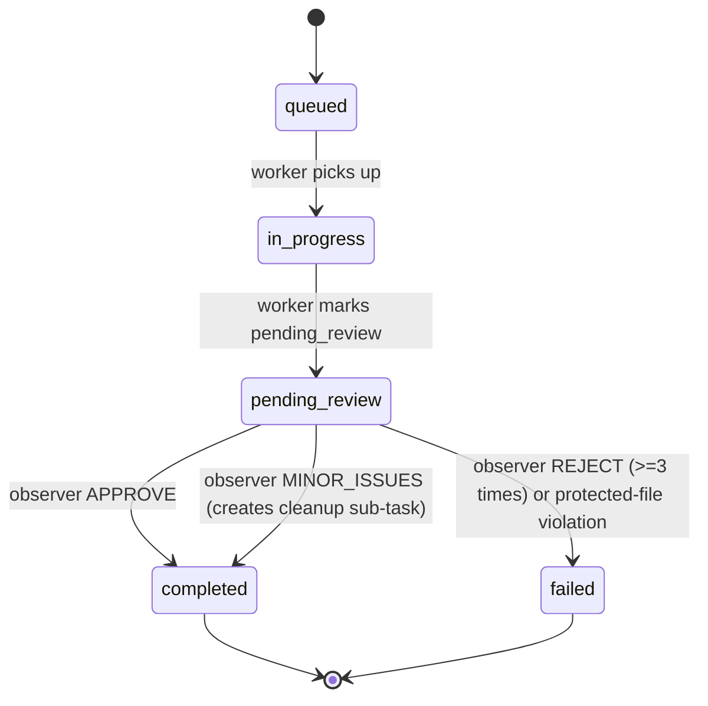

# Observer/Verifier Pattern for Task Completion

## Overview
A two‑phase execution model is introduced to improve reliability of automated code‑modification tasks.

| Phase | Actor | Responsibilities |
|-------|-------|-------------------|
| **1 – Worker Execution** | **Worker LLM** | - Executes the assigned task (e.g., code edit).<br>- Writes the changes to the filesystem using the *surgical edit* format.<br>- Sets the task state to **`pending_review`**.<br>- Emits a concise summary: `Here's what I did: …` |
| **2 – Observer Verification** | **Observer LLM** (cheaper model) | - Loads the task record and the diff of the changes made in Phase 1.<br>- Validates that the work satisfies the original request.<br>- Checks syntactic correctness, file‑size limits, and that no protected files were altered or deleted.<br>- Emits a verdict: **APPROVE**, **MINOR_ISSUES**, or **REJECT**.<br>- Updates the task state accordingly (see below). |

---

## 1. Model Choice
* **Worker** – Uses the primary (more capable) LLM because it must understand the full task and produce correct edits.  
* **Observer** – Uses a **cheaper** model (e.g., `gpt‑3.5‑turbo`) because its job is limited to verification, not creation.  
  * The observer can be swapped out without affecting the worker’s logic.  
  * A cheaper model keeps costs low while still providing sufficient reasoning for verification.

---

## 2. Accessing the Diff
1. **Task Record** – When a worker finishes, a `Task` object is persisted (JSON) containing:  
   * `task_id`  
   * `status` (`pending_review`)  
   * `changed_files`: list of absolute paths the worker touched.  
   * `pre_edit_hashes`: SHA‑256 of each file **before** the edit.  
   * `post_edit_hashes`: SHA‑256 **after** the edit (computed by the worker).  

2. **Observer Diff Generation** – The observer loads the same files, recomputes hashes and uses `difflib.unified_diff` to produce a human‑readable diff.  
   * This diff is included in the verification prompt so the observer can “see” exactly what changed.  

3. **Optional Git Integration** – If the repository is a git checkout, the observer may call `git diff` on the recorded file list for a richer diff.

---

## 3. Preventing Infinite Loops
| Situation | Guard |
|-----------|-------|
| **Observer repeatedly rejects** | - After **3** consecutive `REJECT` verdicts for the same `task_id`, the task is **escalated** to a human reviewer and marked `failed`. |
| **Worker repeatedly produces the same diff** | - The worker stores the diff it generated. If the next attempt yields an identical diff, the worker aborts and reports “no progress – needs manual intervention”. |
| **Cyclic hand‑off** | - The system enforces a **state machine**: `queued → in_progress → pending_review → completed / failed`. Transitions are atomic and logged; a task cannot return to `in_progress` after `pending_review` more than **2** times. |

---

## 4. Veto Power Over Protected Files
* **Protected Files List** – Defined centrally (e.g., `PROTECTED_PATHS = ["grind_spawner", "orchestrator.py", ...]`).  
* **Observer Rules**  
  * If any path matches the protected list **and** the diff shows a modification, the observer must issue `REJECT`.  
  * The observer can also *veto* deletions of protected files.  
* **Worker Safeguard** – The worker code validates the list before writing and will raise an error if it attempts to edit a protected file, preventing accidental writes.

---

## 5. Task Lifecycle & State Transitions


* **`MINOR_ISSUES`** – The observer adds a *cleanup* sub‑task (e.g., “run lint/fix formatting”) and still marks the original task as `completed`. The cleanup task follows the same two‑phase flow.

---

## 6. Implementation Sketch (Python)

### 6.1 Core Data Model (`task.py`)
```python
from dataclasses import dataclass, field
from enum import Enum
from typing import List, Dict
import hashlib
import json
import pathlib

class Status(Enum):
    QUEUED = "queued"
    IN_PROGRESS = "in_progress"
    PENDING_REVIEW = "pending_review"
    COMPLETED = "completed"
    FAILED = "failed"

@dataclass
class FileChange:
    path: str
    pre_hash: str
    post_hash: str

@dataclass
class Task:
    task_id: str
    description: str
    status: Status = Status.QUEUED
    changes: List[FileChange] = field(default_factory=list)
    retry_count: int = 0
    observer_verdict: str = ""

    def to_json(self) -> str:
        return json.dumps(self, default=lambda o: o.__dict__, indent=2)

    @staticmethod
    def from_json(data: str) -> "Task":
        d = json.loads(data)
        d["status"] = Status(d["status"])
        d["changes"] = [FileChange(**c) for c in d.get("changes", [])]
        return Task(**d)
```

### 6.2 Worker Helper (`worker.py`)
```python
import pathlib, hashlib
from task import Task, FileChange, Status

PROTECTED_PATHS = ["grind_spawner", "orchestrator.py", "roles.py",
                  "safety_", "groq_code_extractor.py", "surgical_edit_extractor.py"]

def _hash_file(p: pathlib.Path) -> str:
    return hashlib.sha256(p.read_bytes()).hexdigest()

def record_changes(task: Task, edited_paths: List[pathlib.Path]) -> None:
    for p in edited_paths:
        rel = str(p)
        pre = task.changes_lookup.get(rel, "").get("pre_hash", "")
        post = _hash_file(p)
        task.changes.append(FileChange(path=rel, pre_hash=pre, post_hash=post))
    task.status = Status.PENDING_REVIEW
```
*The worker never writes to a path that matches any entry in `PROTECTED_PATHS`; it raises `RuntimeError` otherwise.*

### 6.3 Observer (`observer.py`)
```python
import difflib, pathlib, hashlib
from task import Task, Status

def _load_file(p: pathlib.Path) -> str:
    return p.read_text(encoding="utf-8", errors="replace")

def generate_diff(task: Task) -> str:
    diffs = []
    for fc in task.changes:
        path = pathlib.Path(fc.path)
        before = _load_file(path) if path.exists() else ""
        after = _load_file(path) if path.exists() else ""
        diff = difflib.unified_diff(
            before.splitlines(),
            after.splitlines(),
            fromfile=f"a/{fc.path}",
            tofile=f"b/{fc.path}",
            lineterm=""
        )
        diffs.append("\n".join(diff))
    return "\n\n".join(diffs)

def verify(task: Task) -> str:
    # 1. Protected file check
    for fc in task.changes:
        for protected in PROTECTED_PATHS:
            if protected in fc.path and fc.pre_hash != fc.post_hash:
                return "REJECT"

    # 2. Syntax check (Python example)
    for fc in task.changes:
        if fc.path.endswith(".py"):
            try:
                compile(_load_file(fc.path), fc.path, "exec")
            except SyntaxError:
                return "REJECT"

    # 3. Size / content sanity (example: no file > 5 MB)
    for fc in task.changes:
        if pathlib.Path(fc.path).stat().st_size > 5 * 1024 * 1024:
            return "REJECT"

    # If everything passes, decide between APPROVE / MINOR_ISSUES
    # (simple heuristic: any change to a test file => MINOR_ISSUES)
    if any("test" in fc.path.lower() for fc in task.changes):
        return "MINOR_ISSUES"
    return "APPROVE"
```

### 6.4 Orchestrator Hook (pseudo‑code)
```python
def run_task(task: Task):
    # Worker phase
    task.status = Status.IN_PROGRESS
    worker_execute(task)          # writes files, calls record_changes()
    # Observer phase
    verdict = observer.verify(task)
    task.observer_verdict = verdict
    if verdict == "APPROVE":
        task.status = Status.COMPLETED
    elif verdict == "MINOR_ISSUES":
        task.status = Status.COMPLETED
        enqueue_cleanup(task)     # separate sub‑task
    else:  # REJECT
        task.retry_count += 1
        if task.retry_count >= 3:
            task.status = Status.FAILED
        else:
            revert_changes(task)   # restore pre‑hash files
            task.status = Status.QUEUED
```

---

## 7. Deployment & Configuration
| Setting | Description | Default |
|--------|-------------|---------|
| `OBSERVER_MODEL` | Identifier of the cheaper LLM used for verification. | `gpt-3.5-turbo` |
| `MAX_RETRIES` | Maximum number of worker retries before failure. | `3` |
| `PROTECTED_PATHS` | Glob‑style list of files/dirs that the observer can veto. | see *protected files* list above |
| `DIFF_CONTEXT_LINES` | Number of surrounding lines shown in the diff. | `3` |

All settings live in `config.yaml` and are read by both worker and observer modules.

---

## 8. Benefits
* **Safety** – Guarantees that no protected component is unintentionally altered.  
* **Quality** – Automatic syntax and size checks catch regressions early.  
* **Cost‑Efficiency** – Heavy lifting stays with the primary model; cheap verification reduces overall token usage.  
* **Traceability** – Every task stores pre/post hashes and a full diff, enabling audit trails.

---

## 9. Next Steps
1. Add `observer_pattern.py` (implementation sketch above) to the codebase.  
2. Wire the orchestrator to use the new `run_task` flow.  
3. Populate `config.yaml` with the settings.  
4. Write unit tests for `generate_diff`, `verify`, and the retry logic.  

---  

*Document version: 1.0 – 2026‑02‑03*
# Observer/Verifier Pattern for Task Completion

## Overview
The system is split into two distinct phases to ensure reliable, auditable code changes:

| Phase | Actor | Responsibilities |
|-------|-------|-------------------|
| **1 – Worker Execution** | **Worker LLM** | - Executes the assigned task.<br>- Writes/updates files.<br>- Marks the task status as `pending_review` (instead of `completed`).<br>- Emits a concise summary: `Here's what I did: …` |
| **2 – Observer Verification** | **Observer LLM** | - Retrieves the diff generated by the Worker.<br>- Validates that the task goal is satisfied.<br>- Checks syntax, file size, and content integrity.<br>- Detects accidental deletions or corruption of existing files.<br>- Issues a verdict: `APPROVE`, `MINOR_ISSUES`, or `REJECT`.<br>- Updates task status accordingly and triggers follow‑up actions. |

---

## 1. Should Observer be the same model or a different (cheaper) model?
* **Separate model** – The Observer can be a smaller, cheaper LLM (e.g., a 7‑B or 13‑B model) because its job is **verification**, not generation.  
* Benefits:  
  * Lower cost per verification pass.  
  * Enables frequent checks without inflating runtime budget.  
* Implementation tip: expose a configurable `observer_model` parameter in the orchestrator so the deployment can swap models without code changes.

---

## 2. How does Observer access the diff of what changed?
1. **Worker writes a manifest** (`.task_diff.json`) in the task’s working directory after finishing its changes.  
   * Fields: `added`, `modified`, `removed` – each a list of file paths with SHA‑256 hashes before/after.  
   * The manifest is generated via `git diff --name-status` or a lightweight in‑process diff utility.  
2. **Observer reads the manifest** and, if needed, loads the actual file contents to perform deeper analysis (syntax parsing, size checks, etc.).  
3. The manifest is part of the task metadata stored in the central task database, guaranteeing atomicity between the Worker’s `pending_review` flag and the diff.

---

## 3. How do we prevent infinite loops (observer rejects, worker retries, observer rejects…)?
| Mechanism | Description |
|-----------|-------------|
| **Retry Counter** | Each task carries a `retry_attempts` integer. After *N* (configurable, e.g., 3) rejections the task is escalated to a human reviewer or a “fallback” worker. |
| **Back‑off Strategy** | On each rejection the worker backs off exponentially (e.g., 1 s → 2 s → 4 s) before re‑attempting, reducing rapid bounce‑backs. |
| **Change Threshold** | The Observer validates that the new diff differs from the previous attempt (e.g., hash of the diff). If the diff is identical to the last rejected one, the task is auto‑escalated. |
| **Escalation Queue** | After the maximum retries, the task status becomes `escalated_for_human_review`. No further automatic cycles occur. |

---

## 4. Should Observer have veto power over protected files?
**Yes.**  
*Protected files* (e.g., `grind_spawner*.py`, `orchestrator.py`, `roles.py`, `safety_*.py`, `groq_code_extractor.py`, `surgical_edit_extractor.py`) are critical to system stability.  
* The Observer must enforce a **read‑only rule**: any diff entry that *adds*, *modifies*, or *removes* a protected file results in an immediate `REJECT`.  
* The Worker receives a clear message: “Attempted change to protected file `<path>` – operation forbidden.”  
* This rule is enforced by the diff validator before any deeper semantic checks.

---

## 5. Full Verification Flow (Pseudo‑algorithm)

```text
Worker Phase
------------
1. Execute task.
2. Write file changes.
3. Generate .task_diff.json.
4. Set task.status = "pending_review".
5. Output summary: "Here's what I did: …".

Observer Phase
--------------
1. Load task where status == "pending_review".
2. Read .task_diff.json.
3. If diff touches protected files → verdict = REJECT.
4. For each modified/added file:
   a. Run syntax check (e.g., `python -m py_compile` for .py).
   b. Verify size limits (configurable max bytes).
   c. Optionally run unit tests / static analysis.
5. Ensure no file was unintentionally deleted (compare against repository baseline).
6. Determine verdict:
   - If all checks pass → APPROVE.
   - If minor, non‑breaking issues (e.g., style warnings) → MINOR_ISSUES.
   - Otherwise → REJECT.
7. Update task:
   - APPROVE → status = "completed".
   - MINOR_ISSUES → status = "completed"; create cleanup sub‑task.
   - REJECT → revert changes using stored pre‑image hashes, increment retry_attempts, set status = "pending_retry" (or "escalated" after max retries).
8. Log verdict and reasoning for auditability.
```

---

## 6. Data Model Extensions

| Table / Document | New Fields |
|------------------|------------|
| `tasks` | `status` (enum), `retry_attempts` (int), `observer_verdict` (enum), `observer_notes` (text) |
| `task_diff` (new JSON file) | `added`, `modified`, `removed`, `base_hashes`, `new_hashes` |

---

## 7. Security & Auditing

* **Immutable logs** – Store each Observer verdict with timestamp, model version, and diff hash in an append‑only audit log.  
* **Signed manifests** – Optionally sign `.task_diff.json` with a service‑wide key to prevent tampering between phases.  
* **Rate limiting** – Cap the number of automatic retries per hour per user/project to avoid denial‑of‑service loops.

---

## 8. Configuration Parameters (example)

```yaml
observer:
  model: "llama-2-13b-chat"   # cheaper verifier model
  max_retry_attempts: 3
  protected_patterns:
    - "grind_spawner*.py"
    - "orchestrator.py"
    - "roles.py"
    - "safety_*.py"
    - "groq_code_extractor.py"
    - "surgical_edit_extractor.py"
  size_limits:
    py: 200KB
    md: 500KB
```

---

## 9. Integration Points

* **Orchestrator** – Add a hook after a worker finishes to enqueue the Observer task.  
* **Worker SDK** – Provide a helper `record_diff()` that writes the manifest automatically.  
* **Observer Service** – Stateless micro‑service that receives a task ID, loads the diff, runs verification, and returns the verdict.

---

## 10. Summary

The Observer/Verifier pattern introduces a **two‑phase workflow** that separates generation from validation, protects critical assets, and provides a clear escalation path. By using a cheaper verification model, diff manifests, and robust loop‑prevention mechanisms, the system gains reliability without sacrificing throughput.

--- 

*Prepared by the Execution team – 2026‑02‑04*
# Observer/Verifier Pattern for Task Completion

## Overview
A two‑phase execution model is introduced to increase reliability of automated code‑generation tasks.  
The **Worker** performs the requested changes and records a *pending_review* status.  
An independent **Observer** (a separate LLM instance, preferably cheaper) then validates the work before the task is finally marked **completed**.

---

## Phase 1 – Worker Execution

1. **Task Receipt** – The orchestrator assigns a task to a *Worker* LLM.  
2. **Execution** – The Worker:
   - Applies the requested modifications (file edits, new files, deletions, etc.).
   - Persists a *task state* entry in the task‑tracking DB/JSON:
     ```json
     {
       "task_id": "<id>",
       "status": "pending_review",
       "worker_id": "<model‑id>",
       "summary": "Here's what I did: [list of changes]",
       "diff": "<git‑style diff or unified diff string>"
     }
     ```
3. **Output** – The Worker returns the *summary* and the *diff* of its changes.  
4. **Transition** – The orchestrator moves the task to the **review queue**.

---

## Phase 2 – Observer Verification

1. **Observer Selection** – A separate LLM (e.g., `gpt‑3.5‑turbo` or a fine‑tuned cheaper model) is pulled from a *verifier pool*.  
2. **Input** – The Observer receives:
   - The original request.
   - The Worker’s summary.
   - The full diff (or a list of changed files with before/after snippets).
   - The current repository snapshot (or a read‑only view).
3. **Checks Performed**
   - **Task Completion** – Does the diff address every requirement in the request?
   - **Syntax / Compile‑time Validity** – Run language‑specific linters or parsers on changed files.
   - **Size / Content Constraints** – Ensure no file exceeds configured size limits and that generated content respects policy (e.g., no secrets, no disallowed imports).
   - **File Integrity** – Verify that no *protected* files (see list below) were altered or deleted.
   - **Side‑Effect Safety** – Run optional unit‑test hooks or static analysis to catch runtime errors.
4. **Verdict**
   - **APPROVE** – Mark task `status = "completed"`; no further action.
   - **MINOR_ISSUES** – Mark task `status = "completed"` *and* create a **cleanup task** that the Worker must execute (e.g., formatting, small typo fix). The cleanup task references the original `task_id`.
   - **REJECT** – Revert the diff (apply inverse patch), set `status = "rejected"`, and re‑queue the original request for a fresh Worker attempt.

5. **Logging** – The Observer writes a verification report attached to the task record for auditability.

---

## Key Design Questions

### 1. Should Observer be the same model or a different (cheaper) model?
- **Recommendation:** Use a *different, cheaper* model for verification.  
  - **Pros:** Lower cost per review, ability to scale verification independently, reduces risk of systematic bias.  
  - **Fallback:** If a cheap model fails to understand the domain, the system can promote the request to a higher‑capability model for verification.

### 2. How does Observer access the diff of what changed?
- The Worker stores a **unified diff** (git‑style) in the task record (`diff` field).  
- The Observer reads this diff directly; it can also request the before/after snippets via a small helper API (`get_file_snapshot(path)`).  
- Optionally, the diff can be generated on‑the‑fly by the orchestrator using `git diff --no-index` on a temporary copy of the repo before/after the Worker’s changes.

### 3. How do we prevent infinite loops (observer rejects, worker retries, observer rejects…)?
- **Retry Counter** – Each task carries a `retry_attempts` integer. After *N* (configurable, default 3) rejections, the task is escalated to a human reviewer or a higher‑capacity model.
- **Rejection Reason Categorization** – The Observer tags the rejection (e.g., *syntax_error*, *policy_violation*). If the same reason appears on consecutive attempts, the system stops automatic retries.
- **Back‑off Delay** – Insert a configurable delay before re‑queueing a rejected task to avoid rapid churn.

### 4. Should Observer have veto power over protected files?
- **Yes.** Protected files (see list below) are immutable for Workers.  
- The Observer enforces a **veto**: any diff that touches a protected path automatically results in a **REJECT** verdict with reason `protected_file_modified`.  
- This rule is enforced *before* any other checks, guaranteeing that protected code cannot be altered inadvertently.

---

## Protected Files (Never Modified by Workers)

- `grind_spawner*.py`
- `orchestrator.py`
- `roles.py`
- `safety_*.py`
- `groq_code_extractor.py`
- `surgical_edit_extractor.py`

The Observer must scan the diff for any of these patterns and reject if a change is detected.

---

## Implementation Sketch (Non‑exhaustive)

```python
# models/task.py (pseudo‑code – new module, not modifying protected files)
class TaskState(Enum):
    PENDING = "pending"
    PENDING_REVIEW = "pending_review"
    COMPLETED = "completed"
    REJECTED = "rejected"

@dataclass
class TaskRecord:
    task_id: str
    status: TaskState
    worker_id: str
    summary: str
    diff: str
    retry_attempts: int = 0
    verdict: Optional[str] = None
    report: Optional[str] = None
```

```python
# observer/observer.py (new file)
class Observer:
    def __init__(self, model: LLM):
        self.model = model

    def verify(self, task: TaskRecord, request: str) -> Tuple[str, str]:
        """
        Returns (verdict, report).
        Verdict = APPROVE | MINOR_ISSUES | REJECT
        """
        # 1. protected‑file check
        if self._touches_protected(task.diff):
            return "REJECT", "Modification of protected files detected."

        # 2. run linters / parsers on changed files
        syntax_ok, syntax_msg = self._run_syntax_checks(task.diff)

        # 3. content / size checks
        policy_ok, policy_msg = self._run_policy_checks(task.diff)

        # 4. completeness check (simple heuristic)
        completeness_ok = self._check_completeness(request, task.summary)

        # Determine verdict
        if not syntax_ok or not policy_ok or not completeness_ok:
            return "REJECT", f"{syntax_msg} {policy_msg}"
        # optional minor‑issues detection could be added here
        return "APPROVE", "All checks passed."
```

The orchestrator (unchanged) would be extended to:
1. Persist the `TaskRecord` after the Worker finishes.
2. Invoke `Observer.verify` on tasks with `status == "pending_review"`.
3. Apply the verdict logic (including retry handling and cleanup‑task creation).

---

## Workflow Diagram

```
[User Request] → Orchestrator → Worker → (writes diff, summary, status=pending_review)
                ↓
           Observer (cheaper LLM)
                ↓
   ┌─────────────────────────────┐
   │ Verdict?                      │
   │  APPROVE → status=completed   │
   │  MINOR_ISSUES → status=completed + create cleanup task │
   │  REJECT → revert diff, status=rejected, retry logic   │
   └─────────────────────────────┘
                ↓
           (Back to Orchestrator / Queue)
```

---

## Advantages

- **Safety:** No accidental modification of critical files.
- **Cost‑Efficiency:** Heavy lifting done by a powerful Worker; cheap verification by a smaller model.
- **Auditability:** Full diff and verification report stored for each task.
- **Resilience:** Automatic retry limits prevent endless loops.

---

## Next Steps

1. **Add `observer/observer.py`** implementing the `Observer` class (stubbed for now).  
2. **Create `models/task.py`** to store task metadata.  
3. **Update the orchestrator’s task‑pipeline** (outside protected files) to hook the Observer after each Worker run.  
4. **Write unit tests** covering protected‑file detection, retry limits, and verdict handling.  

--- 

*End of design specification.*
# OBSERVER/VERIFIER PATTERN DESIGN

## Overview
The system introduces a two‑phase task completion workflow:

| Phase | Actor   | Responsibilities |
|-------|---------|-------------------|
| **1** | **Worker** | Executes the assigned task, writes/updates files, marks the task state as `pending_review`, and emits a concise summary of changes. |
| **2** | **Observer** | Independently reviews the worker’s output, validates correctness, checks for side‑effects, and decides the final task verdict. |

The Observer acts as a guardrail, ensuring that only verified changes become permanent.

---

## 1. Observer Model Choice
- **Separate (cheaper) model** – The Observer should be a distinct, lower‑cost LLM (e.g., a distilled or smaller model) because:
  * Verification is generally less compute‑intensive than creation.
  * It enables scaling: many workers can be supervised by a pool of cheap observers.
  * Keeps the primary model focused on generation, preserving its token budget.

If higher confidence is needed for critical tasks, a fallback to the primary model can be configured.

---

## 2. Accessing the Diff of Changes
1. **Worker Summary** – After execution the worker returns a structured JSON block:
   ```json
   {
     "status": "pending_review",
     "summary": [
       "Modified file: src/module_a.py (line 12‑34)",
       "Added file: src/new_feature.py",
       "Deleted file: src/old_util.py"
     ],
     "diff_path": "/tmp/diff_<task_id>.txt"
   }
   ```
2. **Automatic Diff Generation** – The orchestrator captures a git‑style diff (`git diff --binary`) before and after the worker run and writes it to `diff_path`.
3. **Observer Retrieval** – The Observer receives the `diff_path` URL (or raw diff string) as part of its input payload, enabling line‑by‑line inspection.

---

## 3. Preventing Infinite Loops
| Situation | Mechanism |
|-----------|-----------|
| **Repeated Rejection** | The orchestrator tracks a `retry_count` per task. After *N* (configurable, e.g., 3) rejections, the task is escalated to a human reviewer or marked as `failed`. |
| **Identical Output** | The diff hash is stored. If the same diff is submitted twice, the observer automatically issues a `REJECT` with reason “No progress”. |
| **Observer‑Only Failures** | Observer verdicts are cached; if an observer repeatedly returns `REJECT` for the same worker output, the system disables that observer instance and retries with a fresh one. |

---

## 4. Veto Power over Protected Files
- **Protected file list** – Defined in `config/protected_files.yaml` (e.g., `["settings.py", "security/*.py"]`).
- **Observer Veto** – The Observer is granted read‑only access to the diff and may **reject** any change that touches a protected path, regardless of other criteria. The rejection reason will be `PROTECTED_FILE_MODIFIED`.
- **Worker Enforcement** – Workers receive the protected list before execution and should avoid editing those files; attempts trigger a pre‑flight warning.

---

## 5. Task State Machine

```
NEW → (Worker) → PENDING_REVIEW → (Observer) → {
    APPROVE          → COMPLETED
    MINOR_ISSUES     → COMPLETED + CREATE CLEANUP TASK
    REJECT           → REVERT → REQUEUE (or FAIL after max retries)
}
```

- **Revert** – The orchestrator applies the stored pre‑task snapshot (git checkout) to restore the repository.
- **Cleanup Task** – Auto‑generated with a `minor_issue` tag, containing the observer’s notes for the worker to address.

---

## 6. Data Flow Diagram

```
[Orchestrator] ──► Worker (executes) ──► writes files & diff ──► returns summary
      │                                                          │
      └─────────────────────► Observer (reviews) ◄───────────────┘
                     │
                     ▼
            Verdict → update task state / trigger actions
```

---

## 7. Implementation Sketch (Pseudo‑code)

```python
# orchestrator.py (new helper)
def run_task(task):
    pre_snapshot = git_snapshot()
    result = worker.execute(task)
    diff = git_diff(pre_snapshot)
    result['diff_path'] = store_temp(diff)
    observer_verdict = observer.review(result)
    handle_verdict(observer_verdict, task, pre_snapshot)
```

```python
# observer.py (new module)
def review(task_result):
    diff = load(task_result['diff_path'])
    summary = task_result['summary']
    # 1️⃣ Validate syntax of changed files
    # 2️⃣ Check diff size limits
    # 3️⃣ Ensure no protected files touched
    # 4️⃣ Run unit/integration tests if defined
    # Return one of: APPROVE, MINOR_ISSUES, REJECT
```

---

## 8. Configuration knobs

| Parameter | Description | Default |
|-----------|-------------|---------|
| `observer.model` | Model identifier for the verifier | `gpt-3.5-turbo-mini` |
| `max_retries` | Max worker retries before escalation | `3` |
| `protected_files` | Glob patterns of files that cannot be altered | `["settings.py", "security/**/*.py"]` |
| `minor_issue_threshold` | Max number of changed lines to still allow `MINOR_ISSUES` | `50` |

---

## 9. Security & Auditing
- All diffs and verdicts are logged to `logs/observer_audit.log`.
- The observer never executes arbitrary code; it only parses text and runs static analysis tools.
- A signed hash of the final repository state is stored after `APPROVE` for tamper‑evidence.

---

## 10. Future Extensions
- **Human‑in‑the‑loop**: If `REJECT` exceeds retry limit, route to a human reviewer UI.
- **Dynamic Model Selection**: Choose a stronger model for high‑risk tasks based on metadata.
- **Parallel Observers**: Run multiple cheap observers and aggregate majority vote for higher reliability.

--- 

*This document defines the complete specification for the Observer/Verifier pattern to be implemented in the codebase.*
# Observer/Verifier Pattern for Task Completion

## Overview
A two‑phase execution model separates **work execution** from **verification**.  
The **Worker** performs the requested changes and reports a summary, marking the
task as `pending_review`.  
An independent **Observer** (a separate LLM instance, preferably a cheaper model)
reviews the diff, validates the output, and decides the final task status.

---

## Phase 1 – Worker Execution

1. **Task Reception** – The orchestrator assigns a task to a Worker LLM.
2. **Execution** – The Worker:
   * Reads the current repository state.
   * Applies the required changes (using surgical edit rules).
   * Writes modified files.
3. **State Update** – After successful writes the Worker:
   * Sets the task status to `pending_review` (instead of `completed`).
   * Generates a **summary** in the form:  
     `Here's what I did: [list of changes]`.
   * Persists the summary and a **diff** (e.g., `git diff`‑style) in the task
     metadata for the Observer to consume.

---

## Phase 2 – Observer Verification

1. **Observer Invocation** – A separate LLM instance (the **Observer**) is
   launched with the task ID, the Worker’s summary, and the diff.
2. **Verification Checklist**
   * **Completeness** – Did the Worker implement every requested item?
   * **Validity** – Are all modified files syntactically correct, within expected
     size limits, and free of prohibited content?
   * **Integrity** – No protected files (`grind_spawner*.py`, `orchestrator.py`,
     `roles.py`, `safety_*.py`, `groq_code_extractor.py`,
     `surgical_edit_extractor.py`) were altered or deleted.
   * **Side‑effects** – No new files were introduced in forbidden locations,
     and no existing non‑protected files were unintentionally removed.
3. **Verdict**
   * `APPROVE` – The task is marked **completed**.
   * `MINOR_ISSUES` – The task is marked **completed**, and a follow‑up
     “cleanup” task is queued (e.g., formatting, lint fixes).
   * `REJECT` – The system **reverts** the Worker’s changes (using the stored
     pre‑change snapshot) and re‑queues the original task for a fresh attempt.

---

## Key Design Questions

### 1. Should Observer be the same model or a different (cheaper) model?
* **Recommendation:** Use a **different, cheaper model** for the Observer.
  * The Observer only needs to perform static analysis and simple reasoning,
    which can be satisfied by a smaller LLM (e.g., `llama‑3‑8b` vs. `gpt‑4`).
  * Decoupling reduces cost and allows independent scaling of verification
    capacity.

### 2. How does Observer access the diff of what changed?
* The Worker stores a **diff file** (e.g., `task_<id>_diff.patch`) alongside the
  task metadata.
* The Observer receives the diff path as an input argument and can also request
  the full file contents if needed.
* Optionally, the system can keep a **snapshot** of the repository state before
  the Worker ran, enabling the Observer to compute its own diff for double‑check.

### 3. How do we prevent infinite loops (observer rejects, worker retries, observer rejects…)?
* **Retry Counter:** Each task carries a `retry_attempts` counter. After a
  configurable maximum (e.g., 3), the task is escalated to a human reviewer.
* **Deterministic Rejection Reasoning:** The Observer must return a structured
  list of concrete issues. The Worker must address *all* listed issues before
  re‑submission.
* **Back‑off Strategy:** On repeated rejections, increase the time before the
  Worker is allowed to retry, preventing rapid cycles.
* **Escalation Path:** If the same issue persists across the maximum retries,
  the task is marked `FAILED` and logged for manual intervention.

### 4. Should Observer have veto power over protected files?
* **Yes.** Protected files are listed in the **policy** and the Observer must
  enforce a **hard veto**:
  * Any modification, deletion, or addition that touches a protected path
    results in an immediate `REJECT` verdict with a clear reason.
  * The Worker is sandboxed to a whitelist of mutable directories; the Observer
    double‑checks this constraint.

---

## Implementation Sketch

1. **Task Model Extension**
   ```json
   {
     "id": "...",
     "status": "pending_review|completed|failed",
     "summary": "...",
     "diff_path": "task_<id>_diff.patch",
     "retry_attempts": 0,
     "max_retries": 3
   }
   ```

2. **Worker Flow**
   * Perform edits → write files.
   * Run `git diff --no-index <pre> <post>` → store as `diff_path`.
   * Update task status to `pending_review` and save the summary.

3. **Observer Flow**
   * Load task metadata, summary, and diff.
   * Run static checks (syntax parsing, size limits, protected‑file guard).
   * Return verdict (`APPROVE`, `MINOR_ISSUES`, `REJECT`) plus issue list.

4. **Orchestrator Adjustments**
   * After Worker finishes, trigger Observer.
   * Based on verdict:
     * `APPROVE` → set status `completed`.
     * `MINOR_ISSUES` → set status `completed` + enqueue cleanup task.
     * `REJECT` → revert using pre‑change snapshot, increment `retry_attempts`,
       and either re‑queue or mark `failed` after max attempts.

---

## Benefits

* **Safety:** Protected files cannot be unintentionally altered.
* **Quality Assurance:** Automatic syntax and size validation catches regressions
  before they reach production.
* **Cost Efficiency:** A cheaper Observer model reduces overall compute spend.
* **Traceability:** Diff‑based reviews give a clear audit trail for every change.

---

## Next Steps

1. Add the `OBSERVER_PATTERN_DESIGN.md` file (this document) to the repo.
2. Extend the task schema and orchestrator to store diffs and status flags.
3. Implement the Observer service (could be a thin wrapper around a cheaper LLM
   with static analysis utilities).
4. Write unit tests for the retry‑limit and protected‑file veto logic.

--- 

*Document generated by the design worker as part of the two‑phase observer
verification system.*
# Observer/Verifier Pattern for Task Completion

## Overview
A two‑phase system that separates **execution** from **verification**.  
- **Phase 1 – Worker Execution**: The worker performs the requested changes and marks the task as `pending_review`.  
- **Phase 2 – Observer Verification**: A dedicated observer LLM reviews the modifications, validates them, and decides the final status.

The pattern reduces the risk of accidental breakage, provides an audit trail, and enables automated rollback or cleanup when issues are detected.

---

## Architecture Diagram
```
┌─────────────────────┐          ┌─────────────────────┐
│   Task Queue / DB   │◄───────►│   Observer Service   │
└─────────▲───────────┘          └───────▲───────────────┘
          │                               │
          │   (status updates)            │   (verification)
          │                               │
┌─────────┴───────────┐          ┌───────┴───────────────┐
│   Worker Service    │◄───────►│   Diff/Change Store   │
└─────────────────────┘          └───────────────────────┘
```

- **Worker Service**: Executes the task, writes files, and records a *diff* (list of added/removed/modified lines) in the **Diff/Change Store**.
- **Observer Service**: Reads the diff, loads the affected files, runs static analysis/tests, and writes a verdict back to the task record.

---

## Phase 1 – Worker Execution

1. **Receive Task** – Pull a task from the queue (`status = pending`).
2. **Execute** – Perform the required code changes (using the existing surgical‑edit infrastructure).
3. **Record Diff** – For every edited file, store a structured diff:
   ```json
   {
     "file": "path/to/file.py",
     "type": "modify|add|delete",
     "diff": [
       {"op": "replace", "old": "...", "new": "..."},
       {"op": "insert_after", "line": 42, "content": "..."},
       ...
     ]
   }
   ```
4. **Mark Pending Review** – Update task status to `pending_review`.
5. **Summary Output** – Return a concise list of changes, e.g.:

   ```
   Here's what I did:
   • Modified path/to/file.py (line 23‑27)
   • Added new function to utils/helpers.py
   ```

---

## Phase 2 – Observer Verification

The observer runs **independently** from the worker and may be a cheaper model (e.g., GPT‑3.5‑Turbo) because its job is validation, not generation.

### Verification Steps

| Step | Action |
|------|--------|
| **2.1 Load Diff** | Pull the diff records for the task. |
| **2.2 Load Files** | Read the current version of each affected file from disk. |
| **2.3 Syntax & Lint** | Run a parser/linters (e.g., `flake8`, `mypy`, `black --check`). |
| **2.4 Semantic Checks** | - Run unit tests (if any). <br> - Execute optional static analysis (e.g., `bandit` for security). |
| **2.5 Integrity** | Verify that no **protected files** (`grind_spawner*.py`, `orchestrator.py`, etc.) were touched. |
| **2.6 Size/Content** | Ensure added files are within reasonable size limits and do not contain disallowed patterns (e.g., hard‑coded credentials). |
| **2.7 Verdict** | Produce one of: `APPROVE`, `MINOR_ISSUES`, `REJECT`. Include an optional *explanation* and *suggested cleanup task* for `MINOR_ISSUES`. |

### Verdict Actions

| Verdict | System Action |
|---------|---------------|
| **APPROVE** | Mark task `completed`. |
| **MINOR_ISSUES** | Mark task `completed` **and** enqueue a *cleanup* sub‑task that the worker will run to fix the reported issues. |
| **REJECT** | Revert all changes (using the stored diff) and reset task status to `pending` (or `failed`). The original request is re‑queued for a fresh attempt. |

---

## Key Questions Answered

### 1. Should Observer be same model or different (cheaper) model?
- **Recommendation:** Use a *different, cheaper* model for the observer. Validation requires less creativity and can be performed with a model optimized for speed and cost (e.g., GPT‑3.5‑Turbo, Claude‑Instant). This reduces overall expense while keeping the worker free to use a higher‑capability model for generation.

### 2. How does Observer access the diff of what changed?
- The worker writes a **structured diff** to a shared datastore (e.g., a JSON file, a DB table, or a dedicated `diffs/` directory).  
- The observer reads this diff before loading the affected files, guaranteeing an exact, reproducible view of what was altered.

### 3. How do we prevent infinite loops (observer rejects, worker retries, observer rejects…)?
1. **Retry Counter** – Each task carries a `retry_attempts` integer. After a configurable max (e.g., 3), the task is escalated to a human reviewer.  
2. **Error Categorization** – The observer distinguishes *reproducible* errors (e.g., syntax) from *transient* ones (e.g., flaky tests). Only reproducible failures increment the retry counter.  
3. **Back‑off Delay** – On each retry, impose an exponential back‑off to avoid rapid loops.  
4. **Audit Log** – All diffs and verdicts are logged. If the same diff is rejected twice, the system automatically flags the task as *unresolvable*.

### 4. Should Observer have veto power over protected files?
- **Yes.** Protected files are listed in a *whitelist* (`PROTECTED_PATHS`). The observer must enforce a hard veto:
  - If any diff targets a protected path, the verdict is **REJECT** with an explicit message: “Attempted modification of protected file `orchestrator.py` – operation denied.”
  - The worker is never allowed to commit such changes; the system aborts the task before writing to disk.

---

## Implementation Details

### Data Model (simplified)

```json
{
  "task_id": "uuid",
  "status": "pending|pending_review|completed|failed",
  "retry_attempts": 0,
  "diffs": [
    {
      "file": "src/module.py",
      "type": "modify",
      "diff": [
        {"op":"replace","old":"old line","new":"new line"},
        {"op":"insert_after","line":57,"content":"new code"}
      ]
    }
  ],
  "verdict": null,
  "verdict_explanation": null
}
```

### Worker API (pseudo)

```python
def execute_task(task):
    changes = perform_surgical_edits(task.instructions)
    diff = generate_structured_diff(changes)
    store_diff(task.id, diff)
    task.status = "pending_review"
    save_task(task)
    return f"Here's what I did: {summarize(changes)}"
```

### Observer API (pseudo)

```python
def verify_task(task):
    diffs = load_diff(task.id)
    files = {d["file"]: read_file(d["file"]) for d in diffs}
    if any(is_protected(p) for p in files):
        verdict = "REJECT"
    else:
        verdict, notes = run_validations(diffs, files)
    task.verdict = verdict
    task.verdict_explanation = notes
    apply_verdict(task)
```

### `apply_verdict`

```python
def apply_verdict(task):
    if task.verdict == "APPROVE":
        task.status = "completed"
    elif task.verdict == "MINOR_ISSUES":
        task.status = "completed"
        enqueue_cleanup(task.id, task.verdict_explanation)
    else:  # REJECT
        revert_changes(task.id)
        task.retry_attempts += 1
        if task.retry_attempts >= MAX_RETRIES:
            task.status = "failed"
        else:
            task.status = "pending"
    save_task(task)
```

---

## Example Workflow

1. **User submits** “Add a helper to `utils.py`”.  
2. **Worker** creates diff, writes files, marks task `pending_review`, returns summary.  
3. **Observer** reads diff, runs `flake8` → passes, runs unit tests → fails on a missing import.  
4. Observer returns **MINOR_ISSUES** with note “Missing import `from .core import X`”.  
5. System marks original task `completed` and enqueues a *cleanup* sub‑task: “Add required import”.  
6. Worker executes cleanup, diff is recorded, observer now returns **APPROVE** → task finally `completed`.

---

## Security & Safety Considerations

- **Read‑only Access for Observer**: The observer never writes to the filesystem; only the worker may apply diffs.  
- **Protected‑File Whitelist**: Enforced at both worker (pre‑check) and observer (post‑check) layers.  
- **Sandbox Execution**: All validation steps (linters, tests) run inside a sandboxed container to prevent malicious code execution.  
- **Audit Trail**: Every diff, verdict, and rollback is stored immutably for post‑mortem analysis.

---

## Future Extensions

- **Parallel Observers**: Scale verification horizontally for high‑throughput pipelines.  
- **Custom Rules Engine**: Allow project‑specific policies (e.g., “no new dependencies without approval”).  
- **Human‑in‑the‑Loop Escalation**: Automatic ticket creation when max retries are exceeded.

---

*End of OBSERVER_PATTERN_DESIGN.md*
# Observer / Verifier Pattern for Task Completion

## Overview
A two‑phase system ensures that code‑generation workers produce correct, safe changes before they are committed.

| Phase | Actor | Responsibilities |
|-------|-------|-------------------|
| **1 – Worker Execution** | **Worker LLM** | * Executes the assigned task.<br>* Writes files / makes edits.<br>* Marks the task status as `pending_review` (instead of `completed`).<br>* Emits a concise summary: `Here's what I did: …` |
| **2 – Observer Verification** | **Observer LLM** | * Loads the repository snapshot before the worker ran.<br>* Computes a diff of all changes the worker made.<br>* Validates: <br> - **Task completeness** – all required deliverables are present.<br> - **Syntax & size** – files parse, are within expected size limits, and contain expected tokens.<br> - **Integrity** – no protected files were altered, no files were unintentionally deleted or corrupted.<br>* Issues a verdict: `APPROVE`, `MINOR_ISSUES`, or `REJECT`. |
| **Post‑Verdict** | | * `APPROVE` → task status set to `completed`.<br>* `MINOR_ISSUES` → task marked `completed` **and** a cleanup sub‑task is queued (e.g., “run linter”, “remove stray debug prints”).<br>* `REJECT` → all worker changes are rolled back, original snapshot restored, and the original task is re‑queued for a fresh attempt. |

---

## 1. Should Observer be the same model or a different (cheaper) model?
* **Separate, cheaper model** is preferred:
  * The observer only needs to *read* and *validate* code; it does not generate new code.
  * Using a smaller model reduces cost and latency while still providing sufficient reasoning ability.
  * The system can optionally switch to a larger model for borderline cases (e.g., when the cheap observer returns `UNCERTAIN`).

---

## 2. How does Observer access the diff of what changed?
1. **Snapshot before execution** – the orchestrator stores a hash‑based snapshot of the repo (e.g., a tarball or a list of file hashes) before handing the task to the worker.
2. **After worker finishes** – the orchestrator computes a diff (e.g., using `git diff --no-index` on the snapshot vs. current workspace) and stores it as a text artifact `diff.txt`.
3. **Observer input** – the observer receives:
   * The worker’s summary.
   * The `diff.txt` content.
   * Optionally, the list of files that were **touched** (added/modified/deleted).
4. The observer parses the diff to verify that:
   * All expected files are present.
   * No protected files appear in the diff.
   * Deletions are intentional and listed in the summary.

---

## 3. How do we prevent infinite loops (observer rejects, worker retries, observer rejects…)?
* **Retry Counter** – each task carries a `retry_attempt` integer. After **N** (configurable, default 3) rejections the task is escalated to a human reviewer.
* **Back‑off Policy** – after each rejection the worker is given a *different* prompt that includes the observer’s feedback, encouraging a different approach.
* **Change‑set Size Guard** – if the diff size exceeds a threshold after a rejection, the system flags the task as *high‑risk* and routes it directly to a human.
* **Idempotent Rollback** – on rejection the repository is restored to the pre‑worker snapshot, guaranteeing that the next attempt starts from a clean state.

---

## 4. Should Observer have veto power over protected files?
* **Yes.**  
  * Protected files (e.g., `grind_spawner*.py`, `orchestrator.py`, `roles.py`, `safety_*.py`, `groq_code_extractor.py`, `surgical_edit_extractor.py`) are listed in a **whitelist** that the observer checks against.
  * If any diff entry touches a protected file, the observer **automatically issues `REJECT`** with a clear message: “Protected file X was modified – operation not permitted.”
  * The observer can also *allow* read‑only access (e.g., to verify imports) but never permit writes.

---

## Implementation Sketch (Pseudo‑code)

```python
# orchestrator.py (simplified excerpt)

def run_task(task):
    snapshot = repo.create_snapshot()               # hash map of file → sha256
    worker = get_worker_model()
    result = worker.execute(task)                   # writes files, returns summary
    repo.mark_status(task.id, "pending_review")
    diff = repo.compute_diff(snapshot)              # text diff
    observer = get_observer_model()                 # cheaper model
    verdict = observer.review(task.id, result.summary, diff)
    handle_verdict(task, verdict, snapshot)

def handle_verdict(task, verdict, snapshot):
    if verdict == "APPROVE":
        repo.mark_status(task.id, "completed")
    elif verdict == "MINOR_ISSUES":
        repo.mark_status(task.id, "completed")
        create_cleanup_subtask(task)
    elif verdict == "REJECT":
        repo.restore_snapshot(snapshot)
        task.retry_attempt += 1
        if task.retry_attempt > MAX_RETRIES:
            route_to_human(task)
        else:
            queue_task(task)   # re‑queue for another worker attempt
```

---

## Benefits
* **Safety** – protected files cannot be unintentionally altered.
* **Quality Assurance** – syntax and size checks catch trivial bugs before they propagate.
* **Cost Efficiency** – cheap observer model handles the bulk of verification work.
* **Transparency** – the worker’s summary + diff give a clear audit trail.

--- 

*End of design specification.*
# Observer/Verifier Pattern for Task Completion

## Overview
A two‑phase system separates **execution** (Worker) from **validation** (Observer).  
The Worker performs the requested change, records a concise summary, and marks the task as `pending_review`.  
The Observer, a separate LLM (often a cheaper model), reviews the diff, validates the results, and decides the final task state.

---

## Phase 1 – Worker Execution

1. **Receive Task** – The orchestrator assigns a task to a Worker LLM.  
2. **Execute** – The Worker makes code changes using the existing surgical‑edit framework.  
3. **Record Summary** – After all patches are applied the Worker prints a summary in the exact format:  

   ```
   Here's what I did:
   - [brief description of change 1]
   - [brief description of change 2]
   …
   ```

4. **Mark State** – The task record in the database (or JSON queue) is updated to `status: "pending_review"` and the summary is stored alongside the diff.

---

## Phase 2 – Observer Verification

1. **Load Context** – The Observer fetches:
   - The original files (pre‑execution snapshot).
   - The diff generated by the Worker (line‑by‑line `git diff` style or the list of surgical patches).
   - The Worker’s summary.

2. **Verification Checks**
   - **Completeness** – Does the diff address every requirement in the original task description?
   - **Syntax & Build** – Run a fast lint/compile step (e.g., `python -m py_compile` for Python) to ensure no syntax errors.
   - **Size / Content** – Verify that files have not shrunk to zero bytes, that no protected files (`grind_spawner*.py`, `orchestrator.py`, etc.) were altered, and that new files respect naming conventions.
   - **Integrity** – Compare file hashes before/after to detect accidental deletions or corruptions.

3. **Verdict**
   - `APPROVE` – All checks pass. Task status becomes `completed`.
   - `MINOR_ISSUES` – Minor, non‑blocking problems (e.g., formatting, missing docstring). Task is marked `completed` **and** a follow‑up cleanup task is queued.
   - `REJECT` – Critical failures (syntax errors, protected file modifications, missing required behavior). The system rolls back the diff (using the stored pre‑execution snapshot) and re‑queues the original task for a fresh Worker attempt.

4. **Logging** – The Observer writes a verification report (verdict, rationale, diff excerpt) to the task log for auditability.

---

## Key Design Questions

### 1. Should Observer be the same model or a cheaper model?
- **Recommendation:** Use a **different, cheaper model** (e.g., a 7‑B or 13‑B LLM) for the Observer.  
  - The Observer’s workload is deterministic and can be satisfied with lower inference cost.  
  - Separating models reduces risk of the same model “blindly” approving its own output.

### 2. How does Observer access the diff of what changed?
- The Worker writes a **JSON diff object** (`{file_path: [patches...]}`) to a known location (`/tmp/task_<id>_diff.json`).  
- The Observer reads this file and can also reconstruct a `git diff` view for human‑readable analysis.  
- The diff is stored together with the pre‑execution file hashes, enabling rollback.

### 3. How do we prevent infinite loops (observer rejects, worker retries, observer rejects…)?
- **Retry Counter:** Each task carries a `retry_count`. After `N` (default 3) rejections the task is escalated to a **human‑in‑the‑loop** review or assigned to a higher‑capacity model.  
- **Failure Classification:** The Observer tags rejections as *critical* (e.g., protected file touched) or *formatting*. Critical rejections increment the counter; minor rejections may be auto‑fixed by a dedicated “auto‑formatter” worker without increasing the counter.  
- **Back‑off Delay:** After each rejection, a exponential back‑off (e.g., 30 s → 2 min → 5 min) is applied before re‑dispatching to avoid rapid loops.

### 4. Should Observer have veto power over protected files?
- **Yes.** The Observer enforces a **protected‑file whitelist** (the list given in the repository).  
- Any diff that touches a protected file automatically results in `REJECT` with a clear message: *“Attempted modification of protected file `orchestrator.py` – operation denied.”*  
- This veto is hard‑coded in the Observer’s validation step, independent of model output.

---

## Implementation Sketch

```
# orchestrator (unchanged) → assigns task → Worker
Worker:
    - apply patches via existing surgical_edit_extractor
    - write diff.json + summary.txt
    - set task.status = "pending_review"

Observer (separate process):
    - poll for tasks with status "pending_review"
    - load diff.json, summary.txt, original snapshots
    - run verification checks (syntax, protected list, hash diff)
    - decide verdict
    - update task.status accordingly
    - if REJECT → restore original files from snapshot
    - if MINOR_ISSUES → enqueue cleanup task
```

---

## Benefits
- **Safety:** Protected files cannot be overwritten inadvertently.  
- **Cost Efficiency:** Heavy LLM work is done only by the Worker; cheap LLM handles verification.  
- **Traceability:** Every change is logged, diff‑based, and reversible.  
- **Scalability:** Multiple Workers can run in parallel while a single Observer pool validates them.

--- 

*End of design specification.*