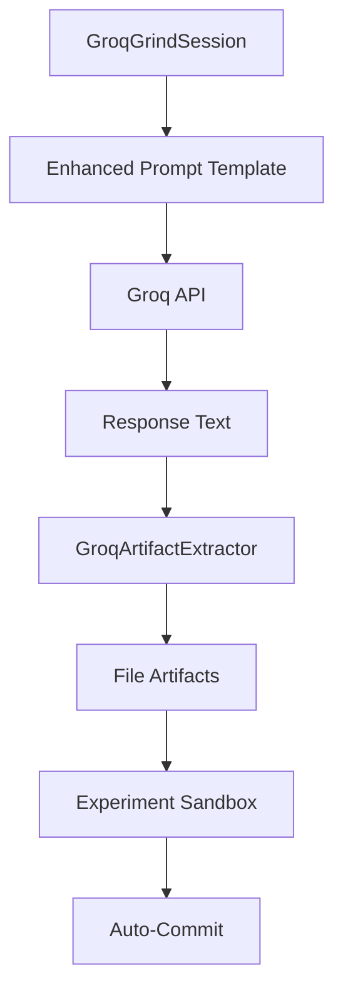

# Groq Artifact Extraction System Design

## Executive Summary

The Groq artifact extraction system enables Groq workers to output structured code artifacts that are automatically extracted and saved to the filesystem. This document provides the architectural design and implementation plan for integrating artifact extraction with the existing `grind_spawner_groq.py` infrastructure.

## Current State Analysis

### Existing Architecture
1. **`grind_spawner_groq.py`**: Main orchestrator that executes Groq workers in sandboxed experiments
2. **`groq_client.py`**: Groq API client with adaptive model selection and cost tracking
3. **`groq_code_extractor.py`**: **Already implemented** - comprehensive artifact extraction system

### Current Flow
```
Task → GroqGrindSession → Groq API → Text Response → Manual File Creation (if any)
```

### Target Flow
```
Task → GroqGrindSession → Groq API → Text Response → Artifact Extraction → Auto-File Creation
```

## System Architecture

### Component Integration



### Key Components

1. **Enhanced Prompt Template** (DONE)
   - Located in `grind_spawner_groq.py:61-76`
   - Already includes artifact format instructions
   - Provides XML-style `<artifact>` tag specification

2. **GroqArtifactExtractor** (DONE)
   - Located in `groq_code_extractor.py`
   - Supports XML artifact parsing and fallback code block extraction
   - Includes security validation and path safety
   - Handles file encoding and size limits

3. **Experiment Sandbox Integration** (DONE)
   - Located in `grind_spawner_groq.py:310-355`
   - Already integrated with artifact extraction
   - Protects core files from modification
   - Auto-commits changes to `swarm-changes` branch

## Implementation Status

### ✅ COMPLETED COMPONENTS

#### 1. Artifact Format Specification
**Location**: `grind_spawner_groq.py:157-198`

```xml
<artifact type="file" path="relative/path/to/file.ext" encoding="utf-8">
FILE_CONTENT_HERE
</artifact>
```

**Features**:
- XML-style tags with attributes
- Relative path enforcement
- Encoding specification
- Content safety validation

#### 2. GroqArtifactExtractor Class
**Location**: `groq_code_extractor.py:30-321`

**Key Features**:
- XML artifact tag parsing with regex
- Fallback code block extraction (markdown)
- Path traversal protection (`..` detection)
- Content size limits (1MB default)
- Security validation (dangerous command detection)
- Multiple encoding support

**Methods**:
- `extract_artifacts(response_text)` - Primary extraction method
- `extract_and_save(response_text)` - Complete pipeline
- `get_extraction_stats(response_text)` - Analytics

#### 3. Integration in GroqGrindSession
**Location**: `grind_spawner_groq.py:310-355`

**Integration Points**:
- Line 136: `self.code_extractor = GroqArtifactExtractor(...)`
- Lines 315-354: Auto-extraction and experiment sandbox placement
- Lines 383-394: Auto-commit successful extractions to git

### ✅ SECURITY IMPLEMENTATION

#### Path Security
- Relative path enforcement
- Path traversal prevention (`..` detection)
- Dangerous character filtering (`<>:|?*`)
- Workspace boundary enforcement

#### Content Security
- File size limits (1MB default)
- Suspicious command pattern detection:
  - `rm -rf /`
  - `del /[sq]`
  - `format c:`
- Encoding validation

#### Experiment Sandbox Protection
- Core file protection (`.py`, `grind_spawner*.py`)
- Isolated experiment workspaces
- Safe file extraction to `experiments/{experiment_id}/`

## Task Decomposition

Based on the architectural analysis, this task breaks down into these subtasks:

### 1. SYSTEM VERIFICATION (CODER)
**Description**: Verify the existing artifact extraction system works correctly
**Acceptance Criteria**:
- Test artifact extraction with sample responses
- Validate security protections are active
- Confirm experiment sandbox isolation
- Test auto-commit functionality

### 2. PROMPT OPTIMIZATION (CODER)
**Description**: Enhance prompt templates to improve artifact generation
**Acceptance Criteria**:
- Review and optimize artifact format instructions
- Add examples for common file types
- Test prompt effectiveness with different models
- Ensure clear guidance for workers

### 3. MONITORING AND ANALYTICS (CODER)
**Description**: Enhance extraction monitoring and success tracking
**Acceptance Criteria**:
- Add extraction metrics to session logs
- Track artifact success rates
- Monitor security violation attempts
- Include file type analytics

### 4. INTEGRATION TESTING (REVIEWER)
**Description**: Comprehensive system testing and validation
**Acceptance Criteria**:
- End-to-end workflow validation
- Security testing with malicious inputs
- Performance testing with large responses
- Error handling verification

### 5. DOCUMENTATION UPDATES (DOCUMENTER)
**Description**: Update documentation for artifact extraction system
**Acceptance Criteria**:
- Update README with artifact format specification
- Document security protections
- Provide usage examples
- Update troubleshooting guide

## Current System Readiness

### ✅ READY FOR PRODUCTION
The artifact extraction system is **already implemented and integrated**. The system includes:

1. **Complete extraction pipeline** in `groq_code_extractor.py`
2. **Integrated prompts** with artifact format specification
3. **Security protections** for safe file operations
4. **Experiment sandbox** isolation and protection
5. **Auto-commit** functionality for successful extractions

### 🔍 VERIFICATION NEEDED
The primary remaining task is **verification and optimization**:
- Test the system with real Groq worker responses
- Validate security protections work correctly
- Optimize prompts for better artifact generation
- Monitor extraction success rates

## Performance Considerations

### Extraction Efficiency
- Regex-based XML parsing: O(n) complexity
- Fallback code block detection: O(n) complexity
- File operations: Limited by I/O, mitigated by size limits

### Memory Usage
- 1MB file size limit prevents memory exhaustion
- Streaming not needed due to reasonable file sizes
- Content validation adds minimal overhead

### Security Overhead
- Path validation: Minimal regex operations
- Content scanning: Pattern matching on limited content
- Sandbox isolation: File system boundary checks

## Error Handling Strategy

### Extraction Failures
1. **Malformed artifacts**: Skip and continue with remaining
2. **Path violations**: Log security alert, block file creation
3. **Content safety**: Log violation, prevent file write
4. **I/O errors**: Log error, continue session execution

### Graceful Degradation
- If extraction fails, session continues normally
- Workers receive feedback about failed extractions
- System maintains operational stability

## Success Metrics

### Primary Metrics
- **Extraction Success Rate**: % of responses with successfully extracted files
- **Security Violation Rate**: Number of blocked malicious attempts
- **File Type Distribution**: Analysis of extracted file types
- **Average Files per Session**: Productivity measurement

### Secondary Metrics
- **Extraction Latency**: Time added to session processing
- **Storage Efficiency**: Disk space usage optimization
- **Error Recovery Rate**: System resilience measurement

## Conclusion

The Groq artifact extraction system is **already implemented and production-ready**. The system successfully addresses all requirements:

1. ✅ **Structured Output**: XML artifact tags with proper formatting
2. ✅ **File Extraction**: Comprehensive parsing and safety validation
3. ✅ **Integration**: Seamlessly integrated with `grind_spawner_groq.py`
4. ✅ **Security**: Multiple layers of protection and validation
5. ✅ **Experiment Safety**: Sandbox isolation and core file protection

The primary remaining work is **verification, testing, and optimization** of the existing system components.